# spring-boot-multitenant


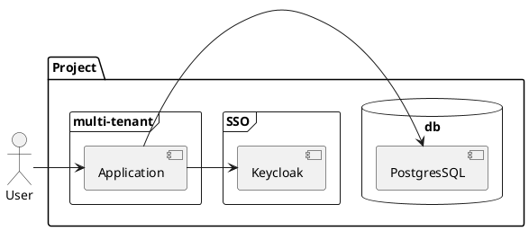

## Setting Up Keycloak

- Run Keycloak

```
docker run --name=czetsuyatech-kc -p 8081:8080 -e KEYCLOAK_USER=admin -e KEYCLOAK_PASSWORD=admin jboss/keycloak:11.0.3
```

### Create Tenant(test1)
- Fire up your browser and navigate to http://localhost:8081, since we are forwarding that port to the container's 8080 where Keycloak is running.

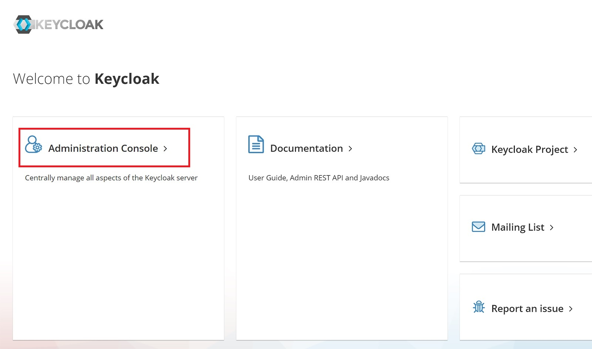

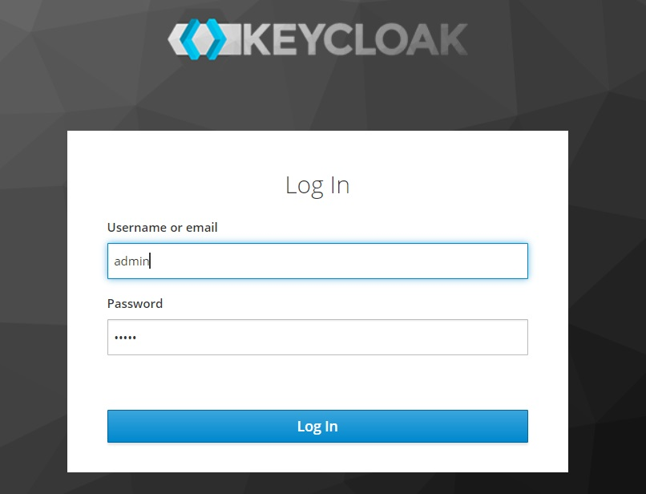

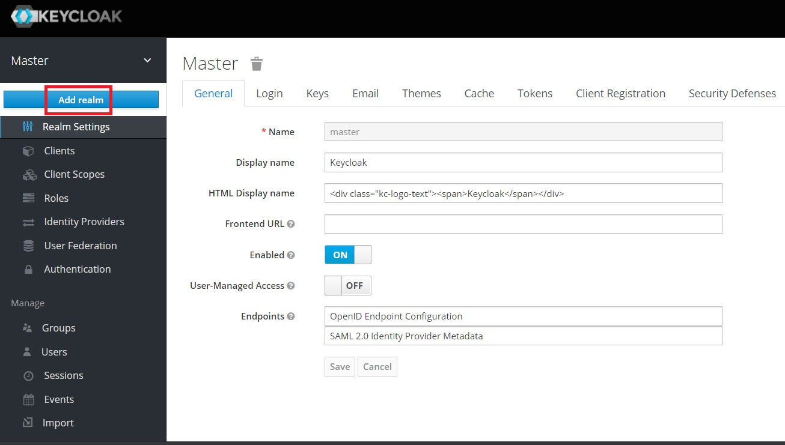

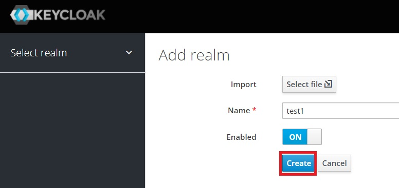


- Create Clients(web)


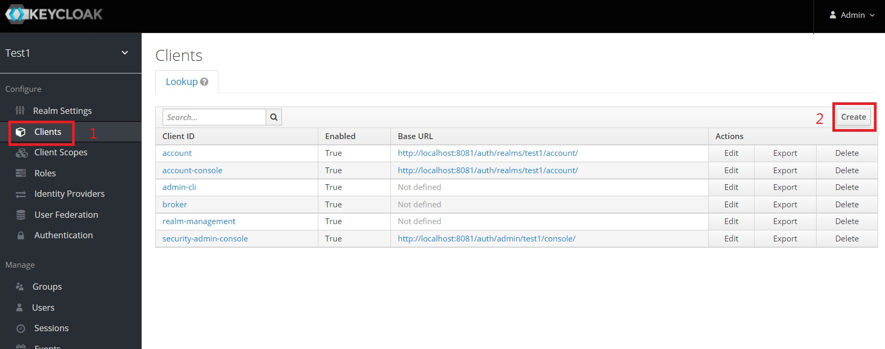

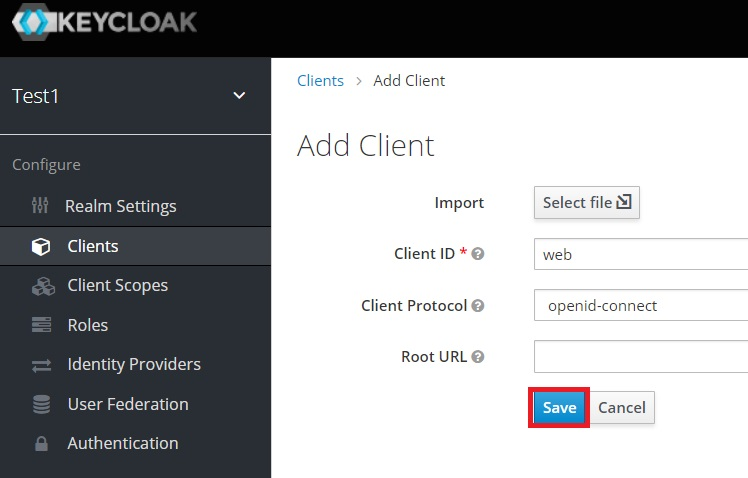

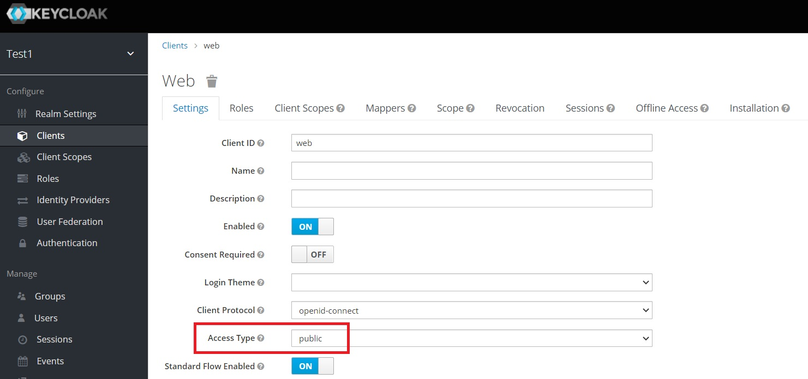

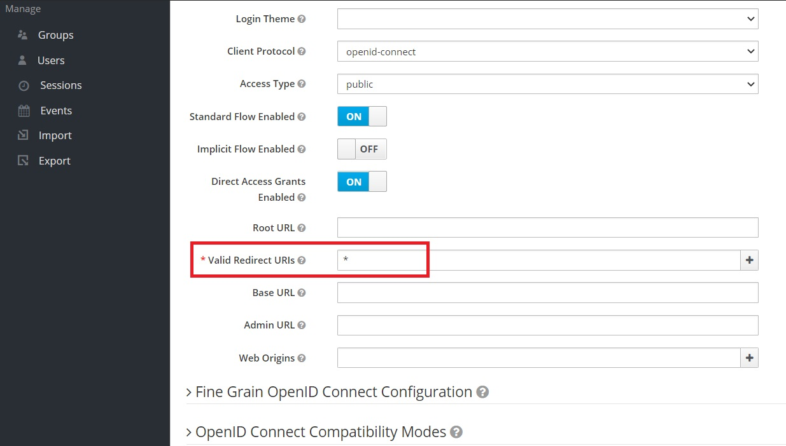

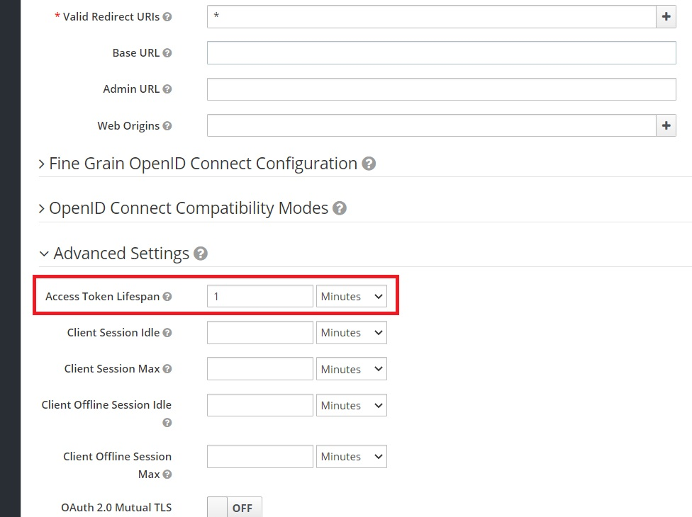


- Add User(user001)


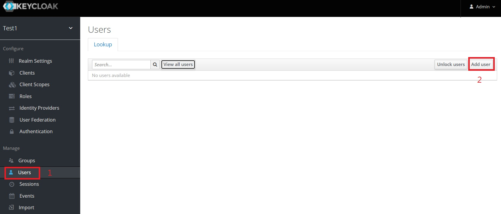

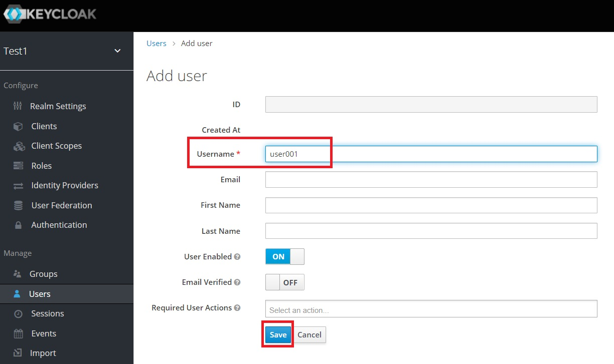

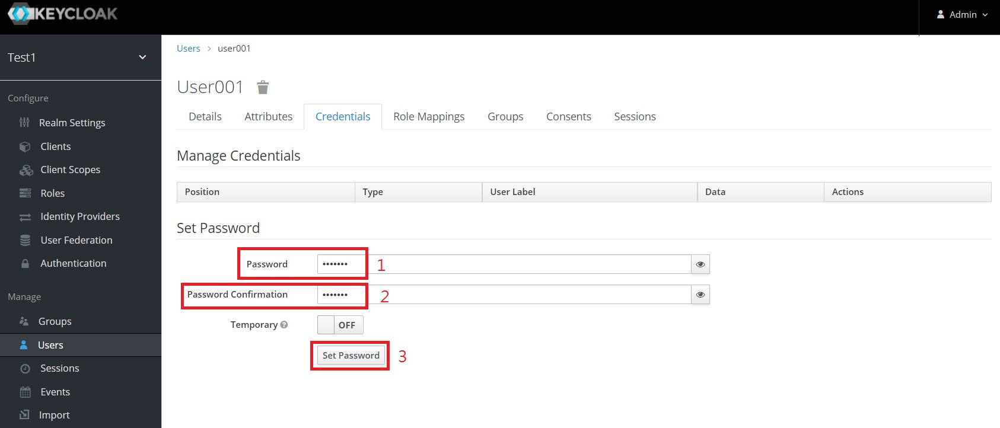


## Setting Up PostgresSQL
- Run PostgresSQL

`docker run -d -p 5432:5432 -e POSTGRES_USER=postgres -e POSTGRES_PASSWORD=postgres --name postgres postgres:9.6-alpine`

- Run [DDL.sql](./src/main/resources/DDL.sql)


## Compile and package

```
./mvnw clean package -Dmaven.test.skip=true
```


## Run it

```
./mvnw spring-boot:run
```


## Testing

- HTTP Request Parameter

```json
# Header
{
    "Authorization": "Bearer LHG2D2eC8FKP8^9xp@DK",
    "X-TenantID": "test1",
}
# Body
{
    
}

```


* `curl -X GET   http://localhost:8080/userInfo/ -H 'Authorization: bearer eyJhbGciOiJSUz...' -H 'Content-Type: application/json' -H 'X-TenantID: test1' -d '{"name":"Mumbai"}'`


* `curl -X GET   http://localhost:8080/logout/ -H 'Authorization: bearer eyJhbGciOiJSUz...' -H 'Content-Type: application/json' -H 'X-TenantID: test1' -d '{"name":"Mumbai"}'`


* `curl -X POST   http://localhost:8080/city/ -H 'Authorization: bearer eyJhbGciOiJSUz...' -H 'Content-Type: application/json' -H 'X-TenantID: test1' -d '{"name":"Mumbai"}'`

* `curl -X POST   http://localhost:8080/city/ -H 'Authorization: bearer eyJhbGciOiJSUz...' -H 'Content-Type: application/json' -H 'X-TenantID: test2' -d '{"name":"Kolkata"}'`

*  `curl -X GET   http://localhost:8080/city/ -H 'Authorization: bearer eyJhbGciOiJSUz...' -H 'Content-Type: application/json' -H 'X-TenantID: test1'`

* `curl -X GET   http://localhost:8080/city/ -H 'Authorization: bearer eyJhbGciOiJSUz...' -H 'Content-Type: application/json' -H 'X-TenantID: test2'`


## References


[Multi-Tenancy Implementation using Spring Boot + Hibernate](https://medium.com/swlh/multi-tenancy-implementation-using-spring-boot-hibernate-6a8e3ecb251a)


[How to Implement MultiTenancy with Spring Boot and Keycloak](https://www.czetsuyatech.com/2020/11/how-to-implement-multitenancy-with-spring-boot-and-keycloak.html)


