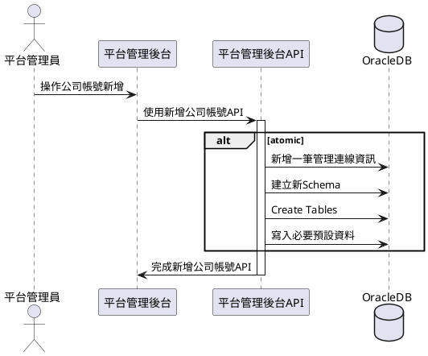
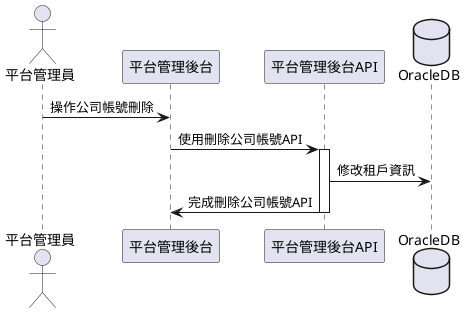
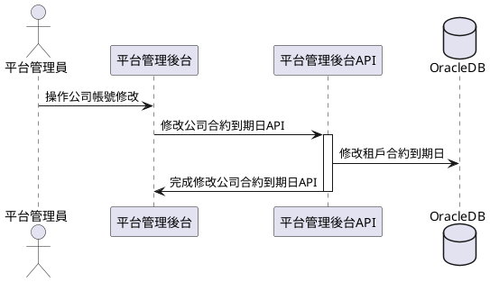

# 系統流程

## 新增租戶

### 說明
1. 當新公司使用合約簽訂後，此SaaS平台管理員，新增此新公司的公司ID和管理員帳號。
2. 平台管理後台網頁呼叫平台管理後台API
3. 建立必要連線資訊和相對應之Schema
4. 完成新增租戶，在UI上顯示成功。

### 時序圖

## 刪除租戶

### 說明
1. 當使用合約到期後，此SaaS平台管理員，手動or排程刪除此公司ID和管理員帳號，採用軟刪除，註記成inactive。
2. 平台管理後台網頁呼叫平台管理後台API
3. 修改租戶資料，生效欄位 true -> false
4. 完成刪除租戶，在UI上顯示成功。

### 時序圖

## 租戶合約延長

### 說明
1. 當使用合約到期後，租戶延長使用，此SaaS平台管理員，手動修改此公司合約資訊迄日。
2. 平台管理後台網頁呼叫平台管理後台API
3. 修改租戶資料，合約到期欄位，新到期日。
4. 完成租戶資料修改，在UI上顯示成功。

### 時序圖
